# Building a Production Slack Bot with Socket Mode in Rust

*Lessons learned from building an AI-powered coding assistant for Slack*

## Introduction

Building a Slack bot seems straightforward until you encounter the subtle complexities of event handling, WebSocket management, and Slack's unique API constraints. This post documents the key learnings from building `slack-coder`, a Slack bot that integrates Claude AI for code generation, using Rust and the slack-morphism library.

## Architecture Overview

The bot acts as a thin message broker between Slack and Claude agents, with Socket Mode providing real-time event delivery without requiring a public HTTP endpoint.


## Key Learning #1: Socket Mode Acknowledgment is Critical

### The Problem

Initially, our event handler looked like this:

```rust
async fn handle_push_event(event: SlackPushEventCallback) -> Result<()> {
    // Process the event (takes 10+ seconds)
    process_message(event).await?;
    Ok(())
}
```

**Result:** WebSocket disconnections with `Protocol(ResetWithoutClosingHandshake)` errors.

### Why It Failed

Slack Socket Mode requires acknowledgment within **3 seconds**. The slack-morphism library sends the acknowledgment AFTER your callback returns:

```mermaid
sequenceDiagram
    participant Slack
    participant Library
    participant Callback

    Slack->>Library: Event via WebSocket
    Library->>Library: Create ACK payload
    Library->>Callback: Call handler
    Note over Callback: Processing takes 10s
    Callback-->>Library: Ok(())
    Library->>Slack: Send ACK
    Note over Slack: ❌ Timeout after 3s!
    Slack->>Library: Close connection
    Slack->>Library: Re-deliver event
```



### The Solution: Asynchronous Processing

Return immediately and spawn background processing:

```rust
async fn handle_push_event(event: SlackPushEventCallback) -> Result<()> {
    let state = extract_state();

    // Spawn background task
    tokio::spawn(async move {
        process_event(event, state).await;
    });

    Ok(()) // Returns in <100ms!
}
```

**New flow:**

```mermaid
sequenceDiagram
    participant Slack
    participant Library
    participant Handler
    participant Background

    Slack->>Library: Event
    Library->>Handler: Call handler
    Handler->>Handler: Extract state
    Handler->>Background: tokio::spawn
    Handler-->>Library: Ok() (immediate!)
    Library->>Slack: ACK (within 3s ✅)
    Note over Background: Processing happens here
    Background->>Slack: Send response later
```



**Key Insight:** Separate acknowledgment from processing. Never block on long-running operations in the event callback.

## Key Learning #2: Event Deduplication is Essential

### The Problem

Slack re-delivers events for various reasons:
- Network retries
- Connection reconnections
- Internal Slack issues

Without deduplication, users receive duplicate responses:

```
User: @bot hello
Bot: Response 1
Bot: Response 2 (1 minute later)
Bot: Response 3 (2 minutes later)
```

### Naive Solution (Doesn't Work)

```rust
// ❌ Time-based deduplication
if last_seen.elapsed() < Duration::from_secs(60) {
    return; // Skip duplicates
}
```

**Problem:** Events re-delivered after 60 seconds are processed again!

### Robust Solution: Permanent Deduplication

```rust
// Shared cache across ALL event callbacks
let processed_events: Arc<DashMap<String, Instant>> = Arc::new(DashMap::new());

// In event handler
let event_key = format!("mention:{}:{}", channel, timestamp);
if processed_events.contains_key(&event_key) {
    return; // Already processed, skip FOREVER
}
processed_events.insert(event_key, Instant::now());
```

**Critical Detail:** The cache MUST be shared via Arc, not recreated per callback!


### Memory Management

Clean up old entries to prevent unbounded growth:

```rust
fn cleanup_old_events(events: &DashMap<String, Instant>) {
    events.retain(|_key, instant| {
        instant.elapsed() < Duration::from_secs(3600) // Keep 1 hour
    });
}
```

## Key Learning #3: Ignore Bot's Own Messages

### The Problem

Bots receive events for ALL messages in channels they're in, including their own:

```
Bot sends: "✅ Setup complete!"
Slack delivers: Message event with bot's text
Bot sees: Message contains "setup"
Bot triggers: New setup workflow
→ Infinite loop!
```

### The Solution: Filter Bot Messages

```rust
// Check if message is from a bot
if message.sender.bot_id.is_some() {
    tracing::debug!("🤖 Ignoring bot's own message");
    return Ok(());
}

// Also ignore message edit events (like progress updates)
if message.subtype == Some(SlackMessageEventType::MessageChanged) {
    tracing::debug!("✏️  Ignoring message edit event");
    return Ok(());
}
```

**Event types to handle:**


## Key Learning #4: User State for Sharing Components

### The Challenge

Event callbacks must be static functions (not closures with captured variables):

```rust
// ❌ Won't compile - captures slack_client
let callbacks = SlackSocketModeListenerCallbacks::new()
    .with_push_events(|event, client, states| {
        let sc = slack_client.clone(); // Error: can't capture!
        Box::pin(handle_event(event, sc))
    });
```

### The Solution: User State

Slack-morphism provides a user state mechanism:

```rust
#[derive(Clone)]
struct BotState {
    message_processor: Arc<MessageProcessor>,
    form_handler: Arc<FormHandler>,
    slack_client: Arc<SlackClient>,
    processed_events: Arc<DashMap<String, Instant>>,
}

// Set state once
let listener_environment = SlackClientEventsListenerEnvironment::new(client)
    .with_user_state(bot_state);

// Access in callback
async fn handle_push_event(
    event: SlackPushEventCallback,
    _client: Arc<SlackHyperClient>,
    user_state: SlackClientEventsUserState,
) -> Result<()> {
    let state: BotState = {
        let storage = user_state.read().await;
        storage.get_user_state::<BotState>()?.clone()
    };

    // Now use state.message_processor, etc.
}
```

**Architecture:**


**Key Insight:** User state is cloned for each callback, so use `Arc` for components that need to be shared (like the deduplication cache).

## Key Learning #5: Markdown Conversion for Slack

### The Challenge

Claude returns standard markdown:
```markdown
## What it does:
**Core functionality** - Exposes local servers
```

Slack uses mrkdwn format:
```
*What it does:*
*Core functionality* - Exposes local servers
```

### Format Differences

| Standard Markdown | Slack mrkdwn | Notes |
|-------------------|--------------|-------|
| `**bold**` | `*bold*` | Single asterisk |
| `*italic*` | `_italic_` | Underscore |
| `## Header` | `*Header*` | No header syntax |
| ` ```code``` ` | ` ```code``` ` | Same |
| `- list` | `• list` | Both work |
| `[link](url)` | `<url\|link>` | Different syntax |

### Conversion Strategy

```rust
pub fn markdown_to_slack(text: &str) -> String {
    let mut result = text;

    // 1. Convert headers to bold
    result = convert_headers(result);  // ## H2 -> *H2*

    // 2. Convert **bold** to *bold*
    result = convert_bold(result);

    // 3. Preserve code blocks (don't convert inside ```)
    result = preserve_code_blocks(result);

    result
}
```

**Using regex for safety:**

```rust
// Extract code blocks first
let code_blocks = extract_code_blocks(text);

// Convert in non-code text
let bold_re = Regex::new(r"\*\*([^\*]+)\*\*").unwrap();
let result = bold_re.replace_all(text, "*$1*");

// Restore code blocks
restore_code_blocks(result, code_blocks)
```

## Key Learning #6: Progressive Enhancement with TodoWrite Hooks

### The Vision

Show real-time progress as Claude works:

```
Progress: 2 / 5
✅ Validate repository access
✅ Clone repository
⏳ Analyzing codebase    ← Updates in real-time!
⬜ Generate system prompt
⬜ Save prompt to disk
```

### Implementation with PostToolUse Hooks


**Setup:**

```rust
// Create shared plan cache
let plan = Arc::new(Mutex::new(Plan::new()));

// Create hook
let hooks = Hooks::new();
hooks.add_post_tool_use_with_matcher(
    "TodoWrite",
    move |input, _id, _ctx| {
        let plan = plan.clone();
        Box::pin(async move {
            if let HookInput::PostToolUse(post) = input {
                let new_plan: Plan = serde_json::from_value(post.tool_input)?;
                plan.lock().unwrap().update(new_plan);

                // Update Slack immediately
                progress_tracker.update_progress(&channel, &new_plan).await;
            }
            HookJsonOutput::Sync(SyncHookJsonOutput::default())
        })
    },
);
```

**Key Insight:** PostToolUse hooks fire DURING agent execution, enabling real-time UX.

## Key Learning #7: Channel-Based Multi-Tenancy

### Design Decision

Each Slack channel gets its own isolated repository and agent:

```
~/.slack_coder/
├── repos/
│   ├── C09NRMS2A58/     ← Channel ID
│   │   └── [git repo]
│   └── C12345XYZ/
│       └── [different repo]
└── system/
    ├── C09NRMS2A58/
    │   └── system_prompt.md
    └── C12345XYZ/
        └── system_prompt.md
```

**Why channel IDs, not repo names?**


**Benefits:**
- No naming conflicts
- Perfect isolation
- Same repo can be used in multiple channels
- Easy cleanup (just delete channel directory)

### Agent Pool Management

```rust
struct AgentManager {
    repo_agents: Arc<DashMap<ChannelId, Arc<Mutex<RepoAgent>>>>,
}

// Startup: Restore agents from disk
for channel_id in slack_client.list_channels() {
    if workspace.is_channel_setup(&channel_id) {
        let agent = create_repo_agent(channel_id)?;
        repo_agents.insert(channel_id, Arc::new(Mutex::new(agent)));
    }
}

// Runtime: Get agent for message
let agent = repo_agents.get(&channel_id)?;
let mut guard = agent.lock().await; // Exclusive access
guard.query(user_message).await?;
```

**Concurrency model:**


**Key Insight:** Use `Arc<Mutex<Agent>>` to allow concurrent channels while preventing race conditions within a channel.

## Key Learning #8: Event Types and Subtypes Matter

### Slack's Event Hierarchy

Slack delivers different event types, and understanding the hierarchy is crucial:


### What We Handle

**1. AppMention** - User @mentions the bot
```rust
SlackEventCallbackBody::AppMention(mention) => {
    // Deduplicate
    // Strip bot mention from text
    // Route to setup or message processing
}
```

**2. Message with ChannelJoin** - Bot invited to channel
```rust
SlackEventCallbackBody::Message(msg) if msg.subtype == ChannelJoin => {
    // Show welcome message
    // Prompt for repository setup
}
```

**3. Regular messages** - Only in threads where bot participated
```rust
SlackEventCallbackBody::Message(msg) if msg.sender.bot_id.is_none() => {
    // Process if in thread with bot
}
```

### Critical Filters

```rust
// Filter 1: Ignore bot's own messages
if message.sender.bot_id.is_some() {
    return Ok(());
}

// Filter 2: Ignore message edits (progress updates)
if message.subtype == Some(MessageChanged) {
    return Ok(());
}

// Filter 3: Deduplicate by timestamp
let event_key = format!("{}:{}", channel, timestamp);
if processed_events.contains_key(&event_key) {
    return Ok(());
}
```

**Without these filters:** Infinite loops and duplicate processing!

## Key Learning #9: Structured Logging for Debugging

### The Challenge

When things go wrong in production, you need to trace the exact flow through the system. With multiple channels, concurrent events, and async processing, this is challenging.

### Solution: Consistent Log Format

```rust
// All logs include channel ID in brackets
tracing::info!("🔔 App mentioned {} by user: {}",
    channel.log_format(),  // [C09NRMS2A58]
    user_id
);

tracing::info!("🔒 Agent locked {}, sending query...", channel.log_format());
```

**Benefits:**
```bash
# Grep all events for specific channel
grep "\[C09NRMS2A58\]" bot.log

# Trace a single request end-to-end
grep "1761510070.169959" bot.log
```

### Emoji Indicators for Visual Scanning

```
🚀 Startup
✅ Success
❌ Error
⚠️  Warning
🔔 App mention
💬 Message processing
🔒 Agent locked
📤 Sending response
🔄 Duplicate detected
🤖 Bot message ignored
```

**Impact:** Spot issues instantly by scanning for ❌ or ⚠️ emojis.

### Log Levels by Component

```rust
// Default: Info level with debug for our code
RUST_LOG=slack_coder=debug,slack_morphism=info

// Troubleshooting: Full debug
RUST_LOG=debug

// Production: Errors only
RUST_LOG=error
```

## Key Learning #10: Agent Lifecycle Management

### The Pattern


**Lifecycle code:**

```rust
// Startup: Restore from disk
async fn scan_and_restore_channels() {
    for channel in slack.list_channels() {
        if workspace.is_channel_setup(channel) {
            let agent = create_repo_agent(channel)?;
            agents.insert(channel, Arc::new(Mutex::new(agent)));
        }
    }
}

// Runtime: Create on demand
async fn setup_channel(channel, repo) {
    let main_agent = MainAgent::new()?;
    main_agent.setup_repository(repo)?;

    let repo_agent = RepoAgent::new(channel)?;
    agents.insert(channel, Arc::new(Mutex::new(repo_agent)));
}

// Background: Cleanup inactive
async fn cleanup_inactive_agents() {
    for (channel, agent) in agents.iter() {
        if agent.lock().await.is_expired(timeout) {
            agents.remove(channel);
        }
    }
}
```

## Production Checklist

Based on these learnings, here's a checklist for production deployment:

### Slack App Configuration
- [ ] Socket Mode enabled with `connections:write` scope
- [ ] All required bot scopes added (9 total)
- [ ] Event subscriptions enabled (4 events)
- [ ] App installed to workspace

### Code Requirements
- [ ] Event callbacks return immediately (<100ms)
- [ ] Long processing spawned as background tasks
- [ ] Event deduplication with shared cache
- [ ] Bot's own messages filtered out
- [ ] Message edits ignored
- [ ] User state properly set with Arc-wrapped components

### Operational
- [ ] Structured logging with channel IDs
- [ ] Debug mode available for troubleshooting
- [ ] Agent pool restoration on startup
- [ ] Graceful handling of WebSocket disconnections
- [ ] Memory management (cache cleanup)

## Conclusion

Building a production-ready Slack bot requires attention to subtle details:

1. **Acknowledge fast** - Return from callbacks in <3 seconds
2. **Deduplicate permanently** - Use shared cache with Arc
3. **Filter aggressively** - Ignore bot messages and edits
4. **Process asynchronously** - Spawn background tasks for heavy work
5. **Share state correctly** - Use Arc for components that must be shared
6. **Log comprehensively** - Include channel IDs and use emojis
7. **Handle all event types** - AppMention, ChannelJoin, regular messages
8. **Test edge cases** - Reconnections, duplicates, timeouts

The result is a stable, scalable bot that handles multiple channels, maintains persistent state, and provides excellent UX with real-time progress updates.

## Code Repository

Full implementation: https://github.com/tyrchen/slack-coder

**Stack:**
- Rust 2024 Edition
- slack-morphism 2.x (Slack API client)
- claude-agent-sdk-rs (AI integration)
- tokio (async runtime)
- dashmap (concurrent hash maps)

## Further Reading

- [Slack Socket Mode Documentation](https://api.slack.com/apis/connections/socket)
- [slack-morphism GitHub](https://github.com/abdolence/slack-morphism-rust)
- [Building Slack Apps](https://api.slack.com/start/building)
- [Slack Message Formatting](https://api.slack.com/reference/surfaces/formatting)

---

*Written after building a production Slack bot that processes 100+ messages/day across multiple channels with zero downtime.*
